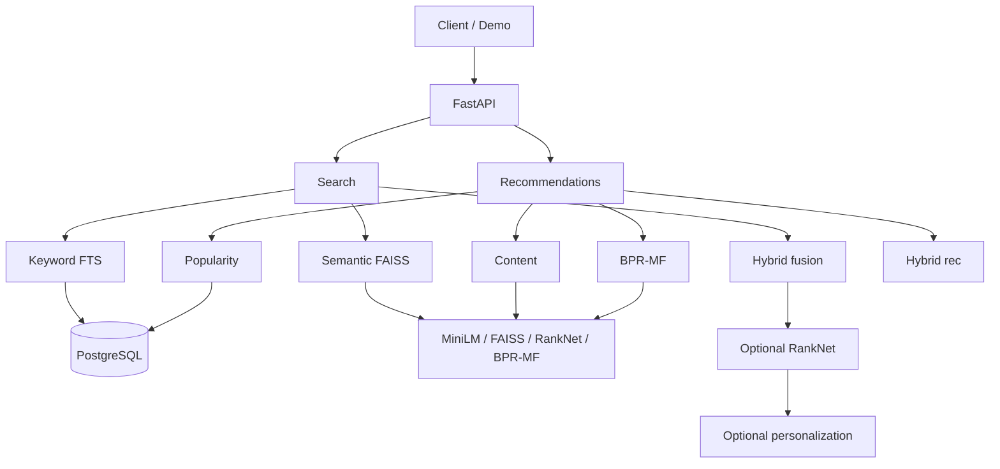

# Intelligent Search & Recommendation Engine

A local product-discovery service: keyword search, semantic retrieval, hybrid fusion, optional learned ranking, bounded personalized reranking, and content / collaborative / hybrid recommendations.

This is an engineering demonstration, not a production storefront. Offline metrics use documented **synthetic** search labels and **observed** recommendation hold-outs. They are not human relevance, CTR, or conversion.

## What it does

Given a text query, the system retrieves a shortlist of products and ranks them. Given a product or user, it returns related items. A small browser demo at `/demo` exercises the same HTTP APIs.

## Key features

- PostgreSQL full-text **keyword** search (default anonymous retrieval)
- MiniLM embeddings + FAISS **semantic** search (`IndexFlatIP` serving)
- **Hybrid** keyword + semantic fusion (weighted and RRF)
- Optional PyTorch **RankNet** rerank of hybrid candidates
- Optional **bounded personalization** that reorders those candidates only
- **Similar-item**, **content**, **collaborative (BPR-MF)**, **hybrid**, and **historical popularity** recommendations
- Offline **Precision@K / Recall@K / MRR / NDCG@K** evaluation code
- Measured **HNSW vs exact FAISS** neighbor-overlap benchmark

## Architecture



Details: [docs/public/ARCHITECTURE.md](docs/public/ARCHITECTURE.md).

## Search pipeline

1. Keyword retrieval uses PostgreSQL `websearch_to_tsquery` and `ts_rank_cd`.
2. Semantic retrieval encodes the query with `all-MiniLM-L6-v2` and searches exact `IndexFlatIP`.
3. Hybrid builds a candidate union (`candidate_k=100` at typical `top_k`) and fuses with **weighted** or **RRF**.
4. Optional RankNet reranks the same hybrid IDs.
5. Optional personalization permutes those IDs using content/CF affinity behind a multiplicative query gate. It never injects recommendation products.

Omitted `retrieval_mode` is **keyword**. The demo sends `fusion_method=weighted` when hybrid is selected. Omitted API `fusion_method` still follows config (`rrf`) so existing callers do not change.

## Recommendation pipeline

- Similar items: embedding neighbors of a product
- Content: mean of a user’s history embeddings
- Collaborative filtering: BPR matrix factorization (`bpr-mf-v1`), catalog coverage is limited
- Popularity: historical interaction counts, not live traffic
- Hybrid recommendations (`hybrid-rec-v1`): weighted fusion of content / CF / popularity over a bounded candidate union, with documented cold-start fallbacks

Omitted user-recommendation `method` remains **content**. The demo explicitly requests `method=hybrid`.

## Personalization

Personalization is opt-in (`personalization_mode=bounded` + `user_id`) and hybrid-only. Candidate IDs are preserved; only order may change.

## Tech stack

Python 3.12, FastAPI, Pydantic, SQLAlchemy, Alembic, PostgreSQL, pandas/pyarrow, sentence-transformers, FAISS, PyTorch, pytest.

## Dataset

Amazon Reviews 2023 **All_Beauty** (McAuley Lab / Hugging Face). Catalog size after ingest: **112,578** titled products; **631,915** users; **694,170** interactions. The slice is sparse; collaborative filtering uses an iterative 2-core subset. Dataset dumps are **not** committed. See [docs/public/DATASET.md](docs/public/DATASET.md).

## Evaluation

Official comparisons use four separate families. Do not mix NDCG across tables.

| Family | Labels | What it measures |
| --- | --- | --- |
| Synthetic search | Product-derived queries and source-product targets | Retrieval/ranking behavior on a frozen test split |
| Personalized search | Synthetic query + observed held-out interaction | Whether bounded rerank moves that target |
| Recommendations | Observed leave-last-item-out | Whether later interactions are recovered |
| ANN | Exact FAISS neighbors | Approximate index overlap and latency |

Full write-up: [docs/public/EVALUATION.md](docs/public/EVALUATION.md). Interview notes: [docs/public/INTERVIEW_GUIDE.md](docs/public/INTERVIEW_GUIDE.md).

## Selected results

On the documented **synthetic** product-query test (603 queries): **keyword** NDCG@10 **0.509**. Hybrid weighted 0.461; RRF 0.439; RankNet 0.404. RankNet did **not** beat hybrid fusion. Semantic-only was weakest on these title/attribute queries.

On **synthetic-query / observed-target** personalized search (22,554 queries): unpersonalized hybrid RRF R@10 **0.418** → personalized **0.465** (NDCG@10 0.259 → 0.312). Candidate IDs were identical.

On the **observed** 2-core recommendation hold-out (22,628 users): hybrid-rec R@10 **0.0533** vs content **0.0511**. CF alone was near popularity (R@10 0.019) and scored **0** on training-unseen items.

ANN Recall@10 is **neighbor overlap with exact FAISS**, not search relevance: HNSW at `efSearch=128` recovered **0.920** of exact neighbors (median 0.49 ms vs exact 17.9 ms). Serving stays exact `IndexFlatIP`.

These numbers are not human-judged NDCG, production CTR, conversion, or A/B results.

## Demo

With artifacts already built:

```bash
source .venv/bin/activate
uvicorn app.main:app --host 127.0.0.1 --port 8000
```

Or: `bash scripts/run_demo.sh`

Then open [http://127.0.0.1:8000/demo](http://127.0.0.1:8000/demo). Also: `/health`, `/ready`, `/docs`.

Example queries: `leather conditioner`, `sunscreen`, `baby shampoo`, `hair color`. Result cards emphasize title, brand, and price; rank, method badges, and a collapsed **Technical details** panel keep scores and product IDs available without a debug-table layout.

## API examples

```bash
curl -sS http://127.0.0.1:8000/health
curl -sS http://127.0.0.1:8000/ready
curl -sS http://127.0.0.1:8000/search \
  -H 'Content-Type: application/json' \
  -d '{"query":"baby shampoo","top_k":5,"retrieval_mode":"keyword"}'
curl -sS http://127.0.0.1:8000/search \
  -H 'Content-Type: application/json' \
  -d '{"query":"leather conditioner","top_k":5,"retrieval_mode":"hybrid","fusion_method":"weighted"}'
curl -sS 'http://127.0.0.1:8000/recommendations/trending?top_k=5'
```

See [docs/public/API.md](docs/public/API.md). Query length is 1–512 characters after strip; `top_k` is 1–100.

## Local setup

PostgreSQL must be installed and running. This is **not** a one-command fresh install.

**A. This machine already has data and artifacts**

```bash
/usr/bin/python3.12 -m venv .venv
source .venv/bin/activate
pip install torch --index-url https://download.pytorch.org/whl/cpu
pip install -e ".[dev]"
cp .env.example .env   # set POSTGRES_PASSWORD; never commit .env
uvicorn app.main:app --host 127.0.0.1 --port 8000
```

**B. Fresh clone**

1. Install Python 3.12 and PostgreSQL.
2. Create role `isre` and databases `intelligent_search_recommendation` and `intelligent_search_recommendation_test` (see commands in [docs/public/DATASET.md](docs/public/DATASET.md)).
3. Copy `.env.example` → `.env` and set the password.
4. `pip install` as above.
5. `alembic upgrade head`
6. Download and prepare All_Beauty, then ingest.
7. Build semantic artifacts; optionally train RankNet and BPR-MF.
8. Start the app. `/ready` will not be fully green until PostgreSQL and required artifacts exist.

## Rebuilding artifacts

```bash
python scripts/download_dataset.py
python scripts/prepare_dataset.py
python scripts/ingest_database.py
python scripts/build_semantic_index.py --device cpu --batch-size 64
python scripts/build_ltr_dataset.py --max-sources 2500 --seed 42 --force
python scripts/train_ranker.py --force --device cpu
python scripts/train_cf.py --force --device cpu --register-artifact
```

Do not commit embeddings, FAISS indexes, `.pt` weights, raw Amazon dumps, or `.env`.

Official evaluation (long-running; uses frozen artifacts):

```bash
python scripts/evaluate_official_search.py --force
python scripts/evaluate_personalized_search.py --official
python scripts/evaluate_official_recommendations.py --force
python scripts/verify_ann_benchmark.py
```

## Running tests

```bash
source .venv/bin/activate
pytest
```

The full suite needs the PostgreSQL **test** database. Unit tests do not download MiniLM.

## Project structure

See [docs/public/PROJECT_STRUCTURE.md](docs/public/PROJECT_STRUCTURE.md).

## Limitations

- No human search-relevance judgments
- Synthetic title/attribute queries favor keyword matching
- Personalized evaluation also uses synthetic queries
- Recommendation metrics are one-positive observed hold-out on a 2-core, not all users
- BPR-MF covers about 9% of the catalog
- Hybrid recommendation candidate pools miss many hold-out items
- HNSW is not exact and is not the serving default
- No Docker, Redis, Elasticsearch, or hosted deployment

## Reproducibility

Random seed default is 42. Policies `hybrid-rec-v1` and `personalized-search-v1` are committed JSON. Model weights and indexes are rebuilt locally. Evaluation formulas live in `app/evaluation/metrics.py`.

## Attribution / third-party components

- Amazon Reviews 2023 (McAuley Lab) — research dataset; not redistributed here
- `sentence-transformers/all-MiniLM-L6-v2`
- FAISS, PyTorch, PostgreSQL, FastAPI, SQLAlchemy, sentence-transformers

A code license for this repository is an owner decision and is not asserted in this snapshot.
