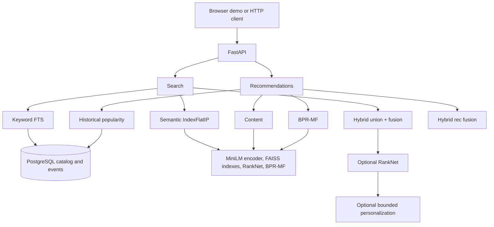

# Architecture

Local modular monolith: one FastAPI process, one PostgreSQL database, and on-disk embedding / index / model artifacts.

## Request paths

Search and recommendations are separate. Personalized search never unions recommendation candidates into the search pool.

## Serving defaults vs demo defaults

| Knob | API omitted/default | Demo sends |
| --- | --- | --- |
| Search retrieval | keyword | user-selected; hybrid uses `fusion_method=weighted` |
| Hybrid fusion if omitted | config `rrf` | explicit `weighted` |
| RankNet | off | optional checkbox |
| Personalization | off | optional + user ID |
| User recommendations | `method=content` | `method=hybrid` |
| Semantic index | exact `IndexFlatIP` | same |

## Components

- **API** — FastAPI + Pydantic. `/health` is process liveness. `/ready` checks PostgreSQL and artifact files.
- **Catalog** — SQLAlchemy models; Alembic migrations; ingest from processed Parquet.
- **Keyword search** — parameterized `websearch_to_tsquery` / `ts_rank_cd` (no string-concatenated SQL).
- **Semantic search** — MiniLM 384-d vectors, L2-normalized, FAISS inner product.
- **Hybrid** — candidate union then RRF (`k0=60`) or min-max weighted (`α=0.5`).
- **RankNet** — small MLP on `rank-features-v1`; hybrid IDs only.
- **Personalization** — `Final = Q(1 + γP)` with `γ ≤ 0.30`; same candidate IDs.
- **Recommendations** — content cosine, BPR dots, COUNT(*) popularity, hybrid-rec weighted 0.60/0.30/0.10.

## Artifacts

Gitignored: embeddings (`.npy`), FAISS `flat.faiss` / `hnsw.faiss`, RankNet `.pt`, BPR-MF weights. Committed: hybrid and personalization policy JSON. Rebuild instructions are in the README.

Semantic runtime loading compares embedding/index manifest identity, both mapping
checksums, and the selected FAISS file's SHA-256 **before** deserialization. It
then checks the actual index type, inner-product metric, dimensions, and counts.
Only files consumed by serving are read; `embeddings.npy` is not loaded or hashed
by this path. Checksums establish consistency with the manifests, not authenticity
against someone able to change both files and manifests.

New semantic builds store `semantic_catalog_sha256` in both manifests. This is
SHA-256 of the exact product-ID/semantic-text pairs in ascending product-ID `C`
collation order, with a versioned domain prefix and 8-byte big-endian UTF-8 byte
lengths before each value. It covers the text representation of title, brand,
category, subcategory, and description. A resolved model revision is passed to
the encoder, including CPU fallback; failed revision discovery remains `null`
and uses unpinned loading.

The first catalog-backed use of each loaded runtime streams and verifies the
catalog fingerprint. Successful verification is cached on that runtime, with a
lock preventing simultaneous first requests from repeating the scan. Later
requests do not rescan; catalog edits require a runtime reset/reload (or process
restart) to trigger validation again. Rebuild artifacts when validation reports
a changed semantic catalog.

Legacy bundles without the fingerprint remain supported with all existing file
checksums and cross-manifest identity checks, plus the existing catalog-count
check. They log a rebuild recommendation because full semantic catalog identity
cannot be verified. Missing selected-file/mapping checksums are rejected for both
legacy and new bundles; a fingerprint present in only one manifest or an invalid
fingerprint is also rejected. Startup never rewrites historical manifests.
